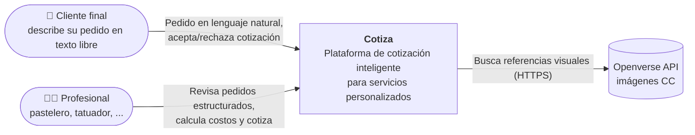
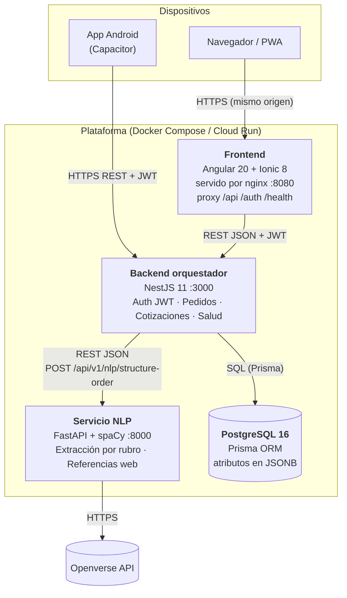
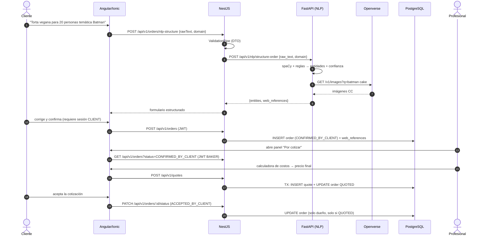
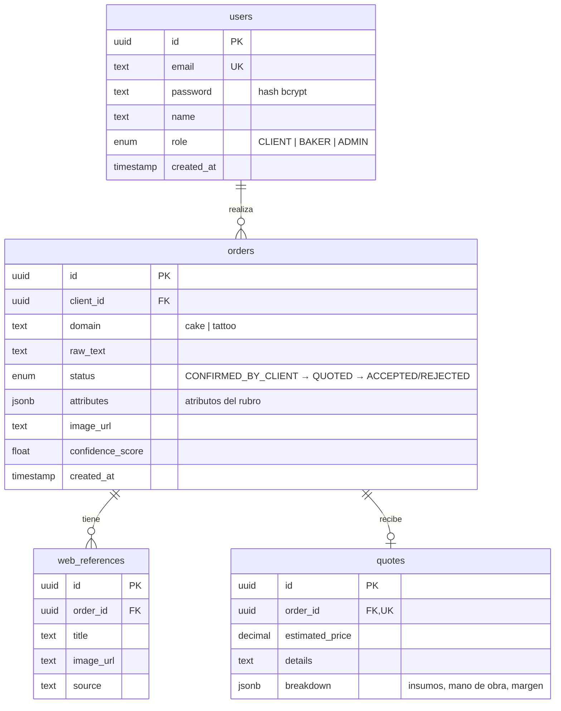
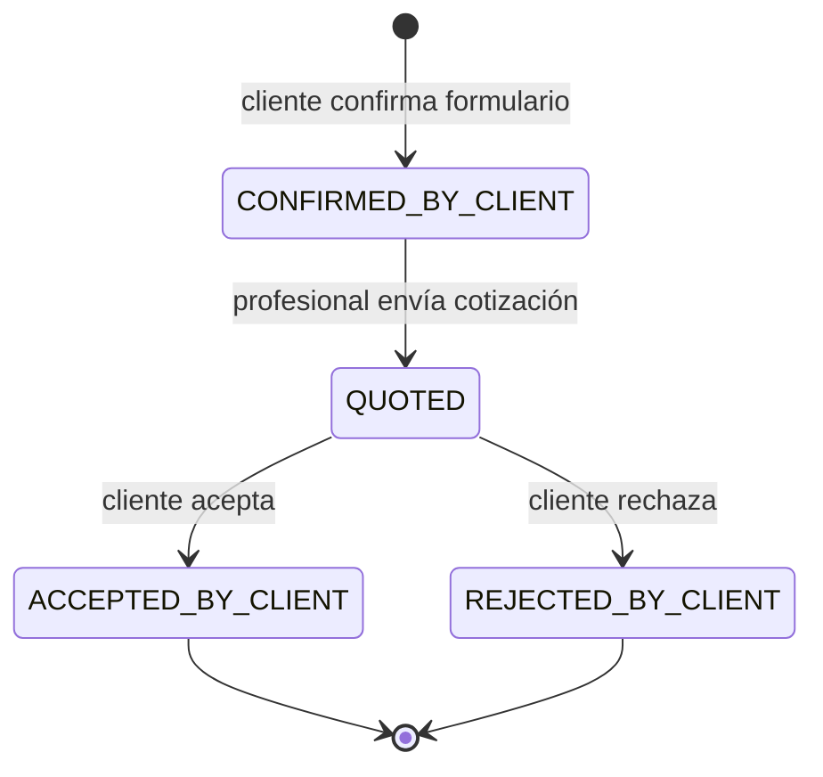
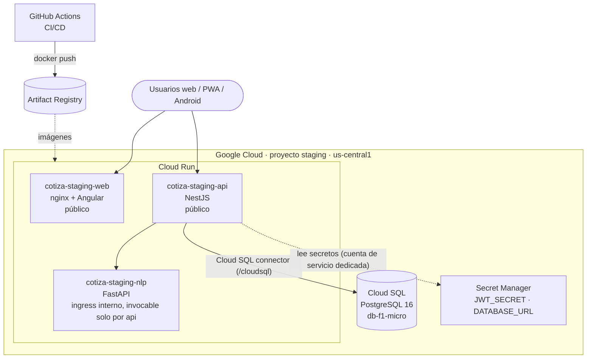

# Arquitectura

Los diagramas usan [Mermaid](https://mermaid.js.org/) y GitHub los renderiza directamente.

## 1. Diagrama de contexto (C4 nivel 1)

## 2. Diagrama de contenedores (C4 nivel 2)

### Responsabilidades

| Contenedor | Responsabilidad | Tecnología |
|---|---|---|
| Frontend | UI multiplataforma, formularios reactivos, guards por rol, interceptores de auth/errores, estado con Signals, PWA | Angular, Ionic, Capacitor, nginx |
| Backend | API REST, validación DTO, autenticación y autorización, ciclo de vida del pedido, cliente HTTP hacia NLP con degradación, migraciones | NestJS, Prisma, passport-jwt |
| Servicio NLP | Extracción de entidades por rubro, cálculo de confianza, obtención de referencias web con caché | FastAPI, spaCy `es_core_news_md`, httpx |
| Base de datos | Usuarios, pedidos, referencias web, cotizaciones | PostgreSQL 16 |

## 3. Flujo principal entre componentes

Si FastAPI no responde, NestJS responde con `fallback: true` y el cliente completa los campos
manualmente; `/health` reporta `pythonService: down` sin marcar la API como caída.

## 4. Modelo de datos inicial

Migración inicial: `backend-nestjs/prisma/migrations/20260928000000_init/migration.sql`.

### Ciclo de vida del pedido

## 5. Diagrama de despliegue preliminar (staging en Google Cloud)

Definido en [`terraform/`](../terraform). Ver [staging.md](staging.md).

## 6. Decisiones arquitectónicas (ADR)

| # | Decisión |
|---|---|
| [001](ADR/001-python-fastapi-nlp.md) | Python + FastAPI + spaCy para NLP como microservicio |
| [002](ADR/002-nestjs-orquestador-prisma.md) | NestJS como orquestador; Prisma con migraciones; atributos en JSONB |
| [003](ADR/003-frontend-ionic-capacitor.md) | Angular + Ionic standalone + Capacitor para web, PWA y Android |
| [004](ADR/004-seguridad-roles-y-degradacion.md) | Autorización por roles y degradación controlada del NLP |
| [005](ADR/005-pipeline-devsecops.md) | Pipeline DevSecOps con quality gates bloqueantes |
